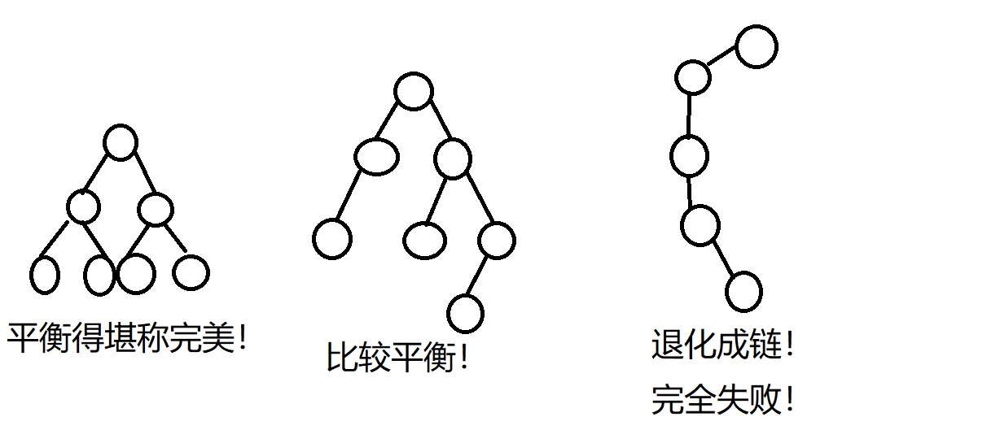
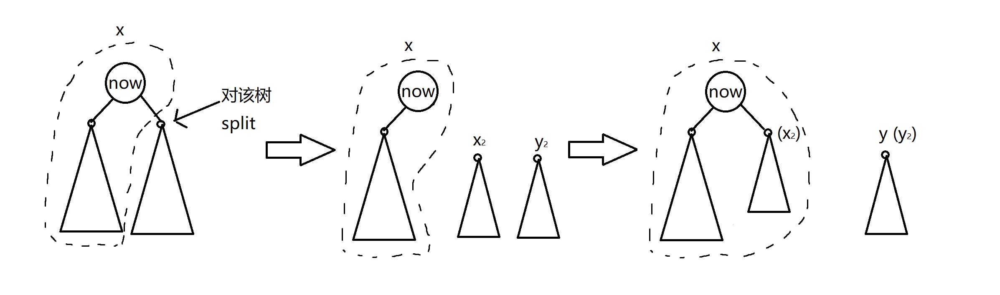

# 浅谈平衡树

## 前言

（这是一篇教程。）

平衡树很重要。因为会了平衡树，你就能自动资瓷下面的数据结构：

1. 最大堆/最小堆（$O(\log n)$ 查找最值/删除）
2. 可并堆（如果支持 $O(\log n)$ 的合并的话）
3. $O(\log n)$ 插入/访问的链表（$O(\log n)$ 的分裂/合并，或者实数映射+重量平衡树）

你还能资瓷一些比较高级的操作：

1. 动态修改森林，支持查询（Link Cut Tree）
2. 动态修改数列，支持查询（单点/区间操作）

当然，这些高级操作本文不会涉及。~~因为作者也不太会~~

你当然还能把一些问题直接归约到平衡树的问题上去，比如经典的逆序对。

总之，平衡树很万金油。**然而平衡树，着实，不好写。**

本文希望通过一些叙述，展示两件事：

1. 平衡树的一些常用操作。
2. 简单好写的平衡树。

## 前置知识

读者需要了解的知识：二叉搜索树的定义，子树的定义，子树大小的定义。

本文的一些约定：

1. 二叉搜索树中，节点保存的信息包括**键**（Key）和**值**（Value），但本文叙述的时候为了方便，会忽略值而只讨论键，相关程序定义中也不会出现值的定义。
2. 为了保证代码的简洁，本文出现的所有代码都没有经过类和模板的封装，且节点都保存在**结构体数组**中，通过下标访问。
3. 二叉搜索树性质定义为：对一个节点，设其键为 $k$，则其左子树中任意节点的键都 $\leqslant k$，右子树中任意节点的键都 $>  k$。这种定义是为了解决存在多个具有相同的键的节点的情况。当然，这种情况的解决方式还有另外几种，但本文不予讨论。
4. 如果你觉得作者~~语文水平辣鸡，~~讲的不知所云，建议看代码来理解。

## 什么是平衡树？

平衡树是二叉搜索树的一类，它是二叉搜索树的改进版本。一般二叉搜索树进行各项操作的时间复杂度都取决于树高 $h$，为 $O(h)$，但当树不平衡，$h$ 相当大时，各项操作的时间成本就可能大大提高。

如果树各个叶子的深度都基本相同，那么树的高度就会趋于 $O(\log n)$，这使得各项操作变得十分高效。平衡树的主要工作，就是用各种方式，保证树的相对平衡。



一般来说，平衡树节点的结构体中应当维护这些信息：左右儿子位置、键、值、子树大小。在进行一些操作后，有些信息可能会发生变化（例如多次旋转后，子树大小可能变化），这就需要我们完成操作的同时，**及时**更新相关信息。

本节的最后，要澄清的一点是：对于不同的平衡树，$O(\log n)$ 的时间复杂度可能有着不同的意义，这也许代表**最坏情况下**是 $O(\log n)$，也许代表**平均意义下**是 $O(\log n)$，也许代表**均摊意义下**是 $O(\log n)$。因此，在实际使用中，针对不同类型的数据，不同平衡树之间的性能可能会有很大的差异。

## 平衡树的静态操作

不同的平衡树往往具有不同的插入/删除/维护平衡操作，但对于其他静态的、只利用了搜索树性质的操作，实现都是类似的。

下面给出这一节会用到的一些定义。

```cpp
struct Tr{
    int siz, k, lch, rch;
    /* siz：子树大小
       k：键
       lch, rch：左右儿子 */
};
Tr* tr; // 结构体数组
const int TREE_NULL = 0;
/* 空节点的下标为 TREE_NULL
   和指针的 NULL 相对应 */
```

**题外话**：下面给出的都是迭代版本的函数，当然可以改写成递归版本。

### 查找某个键

基于搜索树性质，不难写出：

```cpp
int Lookup(int x, int k){
    /* 在以 x 为根的树中
       查找键为 k 的节点，
       返回该节点的下标 */
    while (x != TREE_NULL){
        if (tr[x].k > k)
            x = tr[x].lch;
        else if (tr[x].k < k)
            x = tr[x].rch;
        else return x;
    }
    return TREE_NULL;
}
```

代码的逻辑很明确：

1. 如果 $k$ 等于当前节点的键，就直接返回该节点。
2. 如果 $k$ 大于当前节点的键，就往该节点的右子树中寻找。
3. 如果 $k$ 小于当前节点的键，就往该节点的左子树中寻找。
4. 找不到就返回空节点。

### 询问某个键的排名

此处，定义某个键在树中的排名为该树中的所有键中，小于该键的键个数 $+1$。如键的集合为 $\left\{1, 2, 2, 3, 4, 4\right\}$，那么 $1$ 的排名为 $1$，$2$ 的排名为 $2$，$3$ 的排名为 $4$，$4$ 的排名为 $5$。

该操作过程和查找类似。

```cpp
int Get_Rank(int x, int k){
    /* 在以 x 为根的树中
       查找键 k 的排名并返回 */
    int res = 0;
    while (x != TREE_NULL){
        if (tr[x].k >= k)
            x = tr[x].lch;
        else {
            if (tr[x].lch != TREE_NULL)
                // 加上左子树的大小
                res += tr[tr[x].lch].siz;
            ++res;
            x = tr[x].rch;
        }
    }
    return res + 1;
}
```

代码的逻辑是：用 $res$ 表示该树中的所有键中，小于 $k$ 的键个数。

1. 如果 $k \leqslant$ 当前节点的键，就往该节点的左子树中寻找，不更新 $res$。
2. 否则，就让 $res$ 加上该节点左子树的大小，再 $+1$（因为当前节点的键也小于 $k$），并在该节点的右子树中寻找。

最后返回的就是 $res+1$，即 $k$ 的排名。

### 询问排名为 $k$ 的键

此处，定义排名为 $k$ 的键是：将树中的所有键从小到大排序后，序列里第 $k$ 个键。如键的集合为 $\left\{1, 2, 2, 3, 4, 4\right\}$，那么排名为 $1$ 的键为 $1$，排名为 $5$ 和 $6$ 的键都是 $4$。

该操作过程需要涉及子树大小，但大致流程和查找相同。

```cpp
int Get_Kth(int x, int k){
    /* 在以 x 为根的树中
       查找排名为 k 的键，
       返回该键所在节点 */
    if (k < 1 || k > tr[x].siz) 
        return TREE_NULL;
    int res;
    while (x != TREE_NULL){
        int left_size = 0;
        if (tr[x].lch != TREE_NULL) 
            left_size = tr[tr[x].lch].siz;
        
        if (left_size >= k)
            x = tr[x].lch;
        else if (left_size + 1 == k){
            // 就是当前节点
            res = x;
            break;
        }else {
            k -= left_size + 1;
            x = tr[x].rch;
        }
    }
    return res;
}
```

代码的逻辑是：用 $res$ 表示排名为 $k$ 的键所在节点。每次循环先计算当前节点左儿子的子树大小，设为 $leftsize$，如果左儿子是空就记为 $0$。

1. 如果 $k \leqslant leftsize$，就表明排名为 $k$ 的键应该在左子树中，要往左边走。
2. 如果 $k = leftsize + 1$，就表明排名为 $k$ 的键恰好就在当前节点，于是直接记录答案、退出循环。
3. 否则，就将问题转化为在右子树中，寻找排名为 $k-leftsize-1$ 的键（因为左子树和根占据了前 $leftsize+1$ 个排名）。

### 查找某个键的前驱/后继

定义一个节点的前驱为：对树中序遍历后，得到的序列中，**恰排在该节点前面**的节点。后继可类似定义为：对树中序遍历后，得到的序列中，**恰排在该节点后面**的节点。一般的二叉搜索树的删除操作，就是用后继来“顶替”被删除节点的。

定义一个键的前驱为该键所在节点的前驱的键，后继以此类推。

基于搜索树性质，如果要找 $k$ 的前驱，我们可以从根节点开始，使用以下的贪心算法：

设答案为 $res$，一开始取 $res$ 为负无穷。

1. 如果当前节点为空，就停止寻找答案。
2. 如果当前节点的键 $<k$，就令 $res$ 为当前节点的键，并在该节点右子树中寻找，意图找到比当前 $res$ 更大，但仍 $< k$ 的答案。
3. 否则，就在该节点左子树中寻找。

寻找后继使用的也是类似的策略。

```cpp
int GetPredecessor(int x, int k){
    /* 在以 x 为根的树中
       查找 k 的前驱并返回 */
    int res = -2147483648;  // 负无穷
    while (x != TREE_NULL){
        if (tr[x].k < k){
            res = tr[x].k;
            x = tr[x].rch;
        }else x = tr[x].lch;
    }
    return res;
}
int GetSuccessor(int x, int k){
    /* 在以 x 为根的树中
       查找 k 的后继并返回 */
    int res = 2147483647;   // 正无穷
    while (x != TREE_NULL){
        if (tr[x].k > k){
            res = tr[x].k;
            x = tr[x].lch;
        }else x = tr[x].rch;
    }
    return res;
}
```

## 平衡树的种类

在过去几十年的时间里，有各种各样的平衡树被发明了出来。现在最常用的有这些：

- AVL 树
- 红黑树
- Splay（伸展树）
- Size Balanced Tree
- Treap
- 替罪羊树
- 非旋转 Treap

这些树的应用领域不一，如红黑树因其极佳的效率常被应用于操作系统中，而 Treap、替罪羊树和 Size Balanced Tree 则常见于算法竞赛。

本文重点介绍最后两种，因为这两种树非常好写，且能应付绝大多数问题。

**题外话**：如果你不喜欢树，我猜你会喜欢**跳跃表（Skip Lists）**（见参考文献 [2]）。

### 简单粗暴的平衡树：替罪羊树

**替罪羊树（Scapegoat Tree）**是一种实现起来十分简单的平衡树。

对于维护树的平衡，不同的平衡树给出了不同的解决方案。而替罪羊树给出的解决方案是最为“暴力”的。简而言之，就是四个字——推倒重来。意思就是，如果树不平衡了（需要一种方式度量），就把造成不平衡的子树直接拍扁（flatten），然后按照最平衡的方式——即完全二叉树的方式重建起来。

在这里，判断不平衡的依据是：如果某个节点的左子树大小，或者右子树大小 $>$ 该节点的子树大小 $\times \alpha$，那么就说明该节点所在子树不平衡了，需要重构。在这里，$\alpha \in (0.5, 1)$。我们可以直观地考虑：如果取 $\alpha = 0.5$，那么要求左右两棵子树的大小严格相等，这几乎不可能实现；如果取 $\alpha = 1$，那么相当于什么限制都没设，这就是一个非常 naive 的搜索树。因此，一般情况下会折衷取 $\alpha=0.75$。

首先定义节点的结构体，一些全局变量和一些简单的工具函数。这里用一个结构体数组来存储树。

```cpp
struct Tr {
    int siz, k, lch, rch;
};
Tr tr[400005];
int S, root, max_root_siz;
const double alpha = 0.75;
void init_env(){
    // 初始化相关变量
    S = root = 0;
    max_root_siz = 0;
    tr[0].siz = 0;
}
int tree_new(int k){
    ++S;
    tr[S].siz = 1;
    tr[S].k = k;
    tr[S].lch = tr[S].rch = 0;
    return S;
}
void maintain(int x){
    tr[x].siz = 1 + tr[tr[x].lch].siz + tr[tr[x].rch].siz;
    if (tr[x].siz > tr[x].max_siz)
        tr[x].max_siz = tr[x].siz;
}
void maintain(int x){
    tr[x].siz = 1 + tr[tr[x].lch].siz + tr[tr[x].rch].siz;
}
```

结构体定义中：`siz` 表示该节点所在子树的大小，`k` 表示该节点的键，`lch`、`rch` 分别表示该节点的左儿子和右儿子的下标。全局变量 `S` 表示当前已经新分配的节点个数，`root` 表示树根的下标，`max_root_siz` 表示这棵树从创建到现在为止，最大的时候有多少节点。

在这里，我们令“空节点”的下标为 0，也就是用 0 代表指针式写法的 `NULL`。同时令空节点的子树大小为 0，以减少对边界情况的讨论。

下面解释一下函数。`init_env()` 函数中，由于初始根为空，故设为 0。`tree_new()` 函数返回的是新分配节点的下标，相当于一个构造函数。`maintain()` 函数用于重新计算 $x$ 的  `siz`，有时还会用来维护一些别的东西（如区间反转标记，等）。`is_unbalanced()` 函数用于判定一棵树 $x$ 是否不平衡。

然后，我们来看重构怎么做。

```cpp
int stck[100005], top;
void traverse(int x){
    if (!x) return ;
    traverse(tr[x].lch);
    stck[top++] = x;
    traverse(tr[x].rch);
}
int divide(int l, int r){
    if (r <= l) return 0;
    int mid = (l + r) / 2;
    int rt = stck[mid];
    tr[rt].lch = divide(l, mid);
    tr[rt].rch = divide(mid + 1, r);
    maintain(rt);
    return rt;
}
void rebuild(int &x){
    top = 0;
    traverse(x);
    x = divide(0, top);
}
```

该过程使用了一个栈 `stck` 辅助。`rebuild()` 是将以 `x` 为根的子树重构，传入引用是因为 `x` 可能是某个节点的儿子，重构完之后要改变该节点的儿子的指向。`traverse()` 是对以 `x` 为根的子树做中序遍历，回收该子树的所有节点。`divide()` 是将栈中下标 $[l, r)$ 的节点均分为左右两棵子树，并返回根的一个函数。

**题外话**：这里的重构并不是严格的按照完全二叉树的方法重构的，但两侧节点均分也足够平衡了。

最后，我们先来看插入和删除怎么做。

**题外话**：替罪羊树的插入和删除操作有不同的实现方式，下面将要介绍的版本来源于某篇论文（见参考文献 [1]）。

插入操作：递归插入，和普通的二叉搜索树没两样，唯一的区别在于回溯的时候要判断是否失衡，选择深度最深的失衡节点（叫它替罪羊罢）重构。

```cpp
bool Ins(int k, int &x){
    if (!x){
        x = tree_new(k);
        return false;
    }
    bool has_rebuilt;
    if (k > tr[x].k) has_rebuilt = Ins(k, tr[x].rch);
    else has_rebuilt = Ins(k, tr[x].lch);
    maintain(x);
    if (!has_rebuilt && is_unbalanced(x)) {
        rebuild(x);
        has_rebuilt = true;
    }
    return has_rebuilt;
}
void Insert(int k){
    int targ = Ins(k, root);
    if (tr[root].siz > max_root_siz)
        max_root_siz = tr[root].siz;
}
```

由于我们只重构一棵子树，所以需要返回一个布尔值来表示之前有没有重构过，重构过了之后就不必重构了。注意插入完成之后，要更新一遍 `max_root_siz`。

这里传引用的作用和之前相同。

删除操作：找后继做替换节点，和普通的二叉搜索树没两样，唯一的区别在于如果删除的节点过多要对整棵树重构。

```cpp
void Del(int x){
    int t = root, *p = &root;
    while (t > 0){
        if (x < tr[t].k) --tr[t].siz, p = &tr[t].lch, t = tr[t].lch;
        else if (x > tr[t].k) --tr[t].siz, p = &tr[t].rch, t = tr[t].rch;
        else {
            // 普通二叉搜索树的后继替换
            if (!tr[t].rch) {
                *p = tr[t].lch;
            }else {
                // 注意一路更新 siz
                --tr[t].siz;
                p = &tr[t].rch;
                while (tr[*p].lch > 0)
                    --tr[*p].siz, 
                    p = &tr[*p].lch;
                tr[t].k = tr[*p].k;
                *p = tr[*p].rch;
            }
            return ;
        }
    }
}
void Delete(int k){
    Del(k);
    if (tr[root].siz < alpha * max_root_siz){
        // 重构整棵树
        rebuild(root);
        max_root_siz = tr[root].siz;
    }
}
```

由于找后继的过程用递归不是很好写，还要兼顾对 `siz` 的维护，这里使用一个循环完成删除。删除结束后，如果当前的树大小和最大的时候相比少了很多（表示为 `tr[root].siz < alpha * max_root_siz`），那么就说明删了很多次，树可能不平衡了，要重构一遍。

替罪羊树大体上和普通的二叉搜索树是很相像的，因此上面的静态操作基本上可以直接沿用。

**题内话**：替罪羊树在维护实数映射上很有用，我们马上能够看到一个例子。

### 操纵区间的平衡树：非旋转 Treap

我们学过的 Splay 可以做到对区间反转、分裂、合并等操作。但是 Splay 写起来，好像还是太麻烦了！非旋转 Treap 就是一个不错的替代品。

在学习非旋转 Treap 之前，首先要知道什么是 Treap。**Treap**，又称为**树堆**（因为是 Tree + Heap），是一种具有堆性质的平衡树，这里所说的具有堆性质是指：给每一个节点随机分配一个优先级，树中的任意节点的优先级都小于或等于（也可以大于或等于）该节点儿子的优先级；换言之，这棵树就是一个堆，只不过不是完全二叉树结构的堆。由于优先级是随机分配的， Treap 就相当于随机数据插入的二叉搜索树，故 Treap 在平均意义上是平衡的。

非旋转 Treap 也是具有堆性质的平衡树，但是比 Treap 更加简单和直观。

**注意：下面为了叙述方便，不严格区分“下标”和“下标对应的节点”。**

首先，仍然给出一些定义。

```cpp
struct Tr {
    int siz, v, prio, lch, rch;
};
Tr tr[400005];
int S, root;
void maintain(int x){
    // 更新 x 的子树大小
    tr[x].siz = 1 + tr[tr[x].lch].siz + tr[tr[x].rch].siz;
}
void init_env(){
    // 初始化相关变量
    S = 0; root = 0; tr[0].siz = 0;
    srand(time(NULL));
}
int tree_new(int k){
    // 分配一个新节点
    ++S;
    tr[S].siz = 1, tr[S].v = k, 
    tr[S].prio = rand(), 
    tr[S].lch = tr[S].rch = 0;
    return S;
}
```

结构体定义和替罪羊树基本相同，只是多了一个：`prio` 表示该节点的优先级。在新生成节点时，使用 `rand()` 随机分配优先级。

其他环境的定义和替罪羊树基本相同。

然后介绍非旋转 Treap 的核心操作。非旋转 Treap 的核心操作只有两个：分裂和合并。

分裂操作分为两种：按键分裂和按数量分裂。按键分裂的功能是：给定一个键 $k$，将给定的树按照 $k$ 分割为 $x, y$ 两部分，$x$ 所有节点的键 $\leqslant k$，$y$ 所有节点的键 $> k$。按数量分裂的功能是：给定一个数 $k$，将给定的树按照 $k$ 分割为 $x, y$ 两部分，$x$ 的节点个数为 $k$。

由于非旋转 Treap 满足二叉搜索树性质，故可以以递归的方式完成上述过程。

```cpp
struct pair_of_int{
    // 将 int 二元组封装为结构体
    int x, y;
    pair_of_int(int _x, int _y): x(_x), y(_y){}
};
/** 
 *  以下两个函数均返回一个 int 二元组
 *  表示分割的结果为 (x, y)
 */
pair_of_int Split(int now, int k){
    // 按键分裂
    if (!now) return pair_of_int(0, 0);
    else {
        int x, y;
        if (tr[now].v <= k){
            x = now;
            pair_of_int res = Split(tr[now].rch, k);
            // 这一步是获取进一步递归下去的结果
            tr[now].rch = res.x;
            y = res.y;
        }else {
            y = now;
            pair_of_int res = Split(tr[now].lch, k);
            // 这一步是获取进一步递归下去的结果
            x = res.x;
            tr[now].lch = res.y;
        }
        // 由于操作会使得 now 的子树大小变化，故需要做更新
        maintain(now);
        return pair_of_int(x, y);
    }
}
pair_of_int Split_K(int now, int k){
    // 按数量分裂
    if (!now) return pair_of_int(0, 0);
    else {
        int x, y;
        if (k > tr[tr[now].lch].siz){
            x = now;
            pair_of_int res = Split_K(tr[now].rch, k - tr[tr[now].lch].siz - 1);
            // 这一步是获取进一步递归下去的结果
            tr[now].rch = res.x;
            y = res.y;
        }else {
            y = now;
            pair_of_int res = Split_K(tr[now].lch, k);
            // 这一步是获取进一步递归下去的结果
            x = res.x;
            tr[now].lch = res.y;
        }
        // 由于操作会使得 now 的子树大小变化，故需要做更新
        maintain(now);
        return pair_of_int(x, y);
    }
}
```

解释一下：两个函数都传入 2 个参数，意义是将根的下标为 $now$ 的树按照 $k$ 分割，分割的结果放在 $x, y$ 里，并以二元组形式返回。

对按值分裂，可以这么理解上面的代码：

1. 如果 $now$ 为 0，那么当前要分割的是空树，$x, y$ 自然都是空的，故设为 0。

2. 如果 $now$ 的键 $\leqslant k$，那么 $now$ 及其左子树肯定要分到 $x$ 中去，接下来就对 $now$ 的右子树做分割（因为右子树里面可能有 $>k$ 的成分）。分割右子树会得到 $x_2, y_2$ 两棵树，而 $x_2$ 所有节点的键 $\leqslant k$，那么就要把它接回到 $now$ 的右子树上（因为 $x_2$ 是从 $now$ 的右子树分出来的，它的所有节点的键 $\geqslant now$ 的键） ，作为 $x$ 的一部分；$y_2$ 就作为 $y$ 返回。示意图如下：

   

3. 如果 $now$ 的键 $> k$，那么 $now$ 及其右子树肯定要分到 $y$ 中去，接下来就对 $now$ 的左子树做分割。之后的过程和 2 基本对称，就不叙述。

对按数量分裂，可以类比“询问排名为 $k$ 的键”中提到的方法理解。

**题外话**：上面的代码可以写成下面的简洁表达，但这种写法比较难懂，故不在正文采用。

```cpp
void Split(int now, int k, int &x, int &y){
    if (!now) x = y = 0;
    else {
        if (tr[now].v <= k){
            x = now, Split(tr[now].rch, k, tr[now].rch, y);
        }else {
            y = now, Split(tr[now].lch, k, x, tr[now].lch);
        }
        maintain(now);
    }
}
void Split_K(int now, int k, int &x, int &y){
    if (!now) x = y = 0;
    else {
        if (k > tr[tr[now].lch].siz){
            x = now, Split_K(tr[now].rch, k - tr[tr[now].lch].siz - 1, tr[now].rch, y);
        }else {
            y = now, Split_K(tr[now].lch, k, x, tr[now].lch);
        }
        maintain(now);
    }
}
```

由于非旋转 Treap 平均意义上是平衡的，该操作的时间复杂度平均意义上是 $O(\log n)$。

合并操作的功能是：给定两棵树 $x, y$，保证存在 $k$，使得 $x$ 所有节点的键 $\leqslant k$，$y$ 所有节点的键 $> k$。将两者合并成为一棵树，并在合并的过程中保持堆性质和二叉搜索树性质，使得合并的结果仍是非旋转 Treap。

该操作的实现比较简单。重点是：比较给定的两棵树的根的优先级大小，让优先级小的作为父亲。

```cpp
int Merge(int x, int y){
    if (!x || !y) return x + y;
    if (tr[x].prio < tr[y].prio){
        // y 所有节点的值 > x，故接到 x 的右子树上
        tr[x].rch = Merge(tr[x].rch, y);
        maintain(x);
        return x;
    }else{
        // x 所有节点的值 < y，故接到 y 的左子树上
        tr[y].lch = Merge(x, tr[y].lch);
        maintain(y);
        return y;
    }
} 
```

和分裂操作一样，需要不断更新 $now$ 的子树大小。该操作的时间复杂度平均意义上也是 $O(\log n)$。

有了分裂和合并，要实现一棵搜索树的功能就非常简单了——无非是分裂、合并的排列组合。

插入操作：如果要插入 $k$，那么把整棵树以 $k$ 为基准做一次按值分裂，然后把新节点夹在两棵分裂的树之间再合并起来即可。

```cpp
void Insert(int k){
    int z = tree_new(k);
    pair_of_int res = Split(root, k);
    root = Merge(Merge(res.x, z), res.y);
}
```

删除操作：如果要删除键为 $k$ 的节点，那么把整棵树以 $k-1$ 做一次按键分裂，分成 $x,y$ 两棵树，再做一次按数量分裂，把 $y$ 分成 $w, z$。显然 $w$ 就是要被删除的节点，因此再把 $x, z$ 两棵树合并起来就可以了。

当然，调用该函数之前必须要检查树中是否有键为 $k$ 的节点。

```cpp
bool Lookup(int k){
    int t = root;
    while (t){
        if (tr[t].v < k) t = tr[t].rch;
        else if (tr[t].v > k) t = tr[t].lch;
        else return true;
    }
    return false;
}
void Del(int k){
    pair_of_int res1 = Split(root, k - 1);
    pair_of_int res2 = Split_K(res1.y, 1);
    root = Merge(res1.x, res2.y);
}
void Delete(int k){
    if (Lookup(k)) Del(k);
}
```

剩下的平衡树操作也可以类似地实现。

**题外话 1**：学了非旋转 Treap，那么是不是就没有必要看伸展树了呢？实际上，伸展树除了用来做区间操作之外，还有一个很大的用处是用来对树（图论意义上）进行操作，使得树具有一些动态的性质，如删除某条树边、在某两个点之间连边、查询两个点是否联通等。具有这样功能的伸展树一般被称为**动态树（Link-cut Tree，LCT）**。对其感兴趣的读者可以参考 MIT 6.851 Lecture 19 的内容。

**题外话 2**：据说 LCT 早于伸展树被发明。

**题外话 3**：该数据结构（最初应该）是由某大佬在 2012 年的 WC（信息学竞赛冬令营）上介绍的，但这位大佬实际上想介绍的是利用非旋转 Treap 引申出的**可持久化平衡树**。至于可持久化是什么，简单来说就是支持**时间回溯**——数据结构每一次被修改都会产生一个新的版本，而可持久化就允许数据结构访问它的**历史版本**。根据访问等级的不同（如只读或者可读可写）可以将可持久化划分成不同的类型，感兴趣的读者可以参考 MIT 6.851 Lecture 1 的内容。

**题外话 4**：还有一种拥有树和堆性质的树叫做**笛卡尔树（Cartesian tree）**，它可以通过某个数列构造出来。它具有堆的有序性，而中序遍历的结果就是原数列。如果将数列的值看作优先级，下标看作是键，那么笛卡尔树就变成了 Treap。在这里提到笛卡尔树，是因为在某些场合，需要用笛卡尔树辅助建立 Treap 以降低时间复杂度——笛卡尔树的建立可以在线性时间内完成，但用 Treap 做多次插入是 $O(n\log n)$ 级别（和堆是不是很像？）。由于篇幅限制，此处不介绍笛卡尔树的构造过程，感兴趣的读者可以在网上查找资料。

**题外话 5**：有没有旋转 Treap 呢？当然有！旋转 Treap 维持平衡依靠的也是优先级，它的旋转是用在维护堆性质上的。但由于旋转 Treap 的定位和替罪羊树基本重合了，在这里就没有提到它。感兴趣的读者可以参考《算法竞赛入门经典：训练指南》或者《数据结构与算法分析：C 语言描述》的相关章节学习 Treap。

## 例题

1. SJTU 1221。

   本题用非旋转 Treap 来做再适合不过。例如删除小于 $k$ 的所有元素操作，只要以 $k-1$ 为基准做一次按键分割，得到 $x, y$ 两棵树后，令根变为 $y$ 就行了。

   ```cpp
   void Del_less(int k){
       pair_of_int res = Split(root, k - 1);
       root = res.y;
   }
   ```

   对于另外两种操作同理。

   **题外话**：某位阿炜同学之前认为一次区间删除操作可能带来 $O(k\log n)$ 的操作成本，其中 $k$ 是被删除的节点个数。这意味着总时间复杂度达到无法承受的 $O(nm\log n)$，其中 $m$ 是树的节点总数！但实际上，本题的时间复杂度远没有这么高，为什么？

2. SJTU 4097。

   本题显然也是可以用非旋转 Treap 来做的。

   用替罪羊树能做吗？当然也可以！我们这么考虑：用一个 $[0, 1]$ 之间的数作为链表的节点的“键”。如果要在 $a$ 和 $b$ 这两个节点之间插入节点，那就可以给这个节点新分配一个键为 $\frac{a+b}{2}$。这样，用没有区间操作的平衡树，似乎也能做出来了！

   但是这个方法有一个缺陷：考虑一种极端情况，给链表设一个虚拟的头和尾，令头为 $0$，尾为 $1$，而每次插入都往头的后面插入。这样算下来，第 $n$ 次插入的节点分配到的键应当是 $2^{-n}$。而 $n$ 是 $10^5$ 的量级，这样的精度即使是 `long double` 也无法接受！
   
   幸好，用替罪羊树可以避免这样的问题，因为它有着在树足够不平衡时的爆破机制，我们就可以利用这样的机制，在重建的时候将键重新分配一遍，避免极端情况的产生。在这种情况下，使用 `double` 就能成功通过。
   
   **题外话**：这里提供的两种都是**在线**做法，与之相对的是**离线**做法。离线可以理解成先将问题全部存下来，处理完后再一并回答；在线可以理解成动态地处理，你问一句我答一句。对于某些题目，离线的做法会比在线的做法更加简单，但作者目前没有想到比较好的离线做法。

## 推荐习题

[SJTU 1612](https://acm.sjtu.edu.cn/OnlineJudge/problem/1612)

[SJTU 4048](https://acm.sjtu.edu.cn/OnlineJudge/problem/4048)

## 代码

本文提供的代码均在作者的 Github 仓库上开放，读者可以自由下载。

地址：(等待补充）

## 参考文献

[1] [Scapegoat Trees](http://akira.ruc.dk/~keld/teaching/algoritmedesign_f07/Artikler/03/Galperin93.pdf)

[2] [Deterministic Skip Lists](https://files-cdn.cnblogs.com/files/rocketfan/Deterministic_Skip_Lists.pdf)

本文还参考了众多的博客。